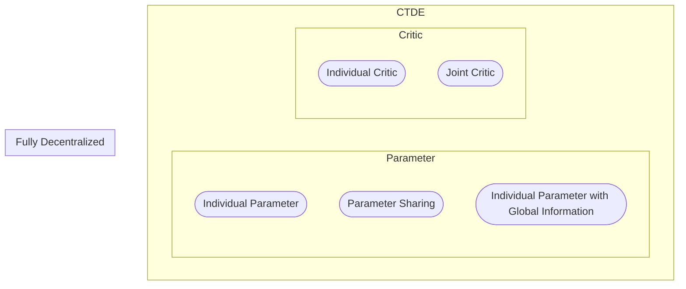
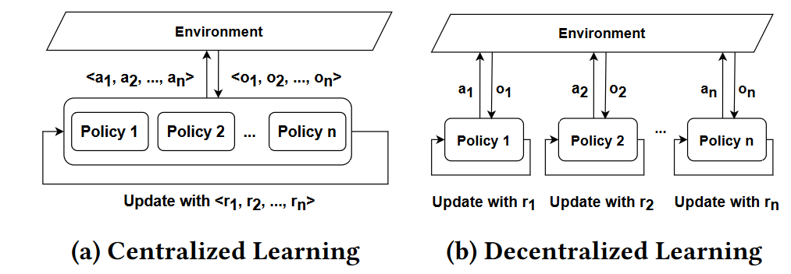
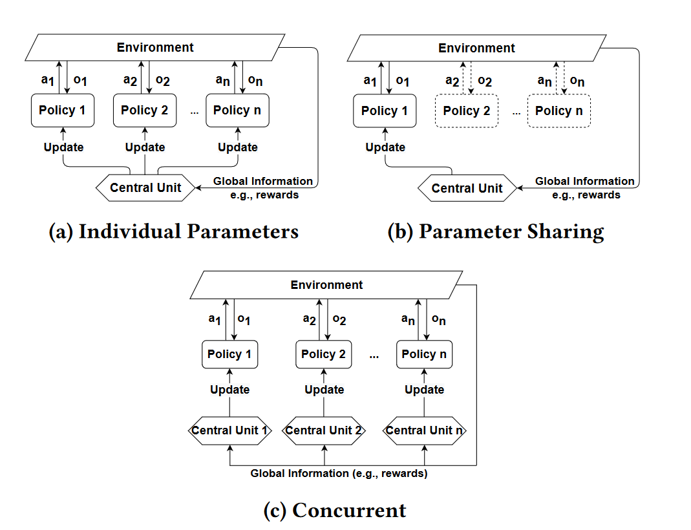

# Multi-agent Communication Algs

Implemented based on [Tianshou](https://github.com/thu-ml/tianshou) and [Pettingzoo](https://github.com/Farama-Foundation/PettingZoo).

## Tutorials

#TODO: jupyter notebook

## Algs

Comm-free baselines
- [ ] IDDPG 
- [ ] MADDPG
- [ ] ISAC 
- [ ] MASAC
- [ ] PPO
- [ ] MAPPO
- [ ] IQL
- [ ] QMIX 
- [ ] QMIX-Attention

Comm baselines
- [ ] [DIAL](https://arxiv.org/abs/1605.06676)
- [ ] [CommNet](https://arxiv.org/abs/1605.07736)
- [ ] [TarMAC](https://arxiv.org/abs/1810.11187)
- [ ] [I2C](http://arxiv.org/abs/2006.06455)
- [ ] [Intention Sharing](https://openreview.net/forum?id=qpsl2dR9twy)

### Simple Taxonomy


### DataFlow in MARL-Comm





We recommend [A Survey of Multi-Agent Reinforcement Learning with Communication](http://arxiv.org/abs/2203.08975) for a detailed taxonomy.

## Training Schemes
| Types               | Sub-types                             |
| ------------------- | ------------------------------------- |
| Fully Decentralized |                                       |
| CTDE                | Individual Parameter                  |
|                     | Parameter Sharing                     |
|                     | Individual Parameter with Global Info |


## Logic of Tianshou in MARL

### Tianshou API Overview


The figure refers to https://colab.research.google.com/drive/1MhzYXtUEfnRrlAVSB3SR83r0HA5wds2i?usp=sharing.

### MARL Design Overview
```mermaid
flowchart
    subgraph mapolicy [MA-policy]
        p1((Agent1)) --action--> m([Manager]) -->|obs or messages| p1
        p2((Agent2)) --action--> m([Manager]) -->|obs or messages| p2
        p3((Agent3)) --action--> m([Manager]) -->|obs or messages| p3
    end    
    
    subgraph collector [Collector]
        VE(VecEnv) ==Transition==> mapolicy ==Action==> VE;
    end
    
    subgraph alg [Algorithm]
        collector ==Data==> B[(Buffer)] ==Sample==> T{Trainer} ==>|Processed Sample| mapolicy ==Info==> T
        T ==Info==> L{{Logger}}
    end
```


An algorithm corresponds to 
+ A MA-policy: interaction among agents, such as the communication 
+ A Buffer: what to store
+ A Trainer: Update, but implemented in each agent's policy actually

## Base MA components

### Buffer

To facilitate the sub-types of CTDE scheme, the buffer should consider the agent dimension. 

1. For the case using a single env, implement the `MAReplayBuffer` as a `ReplayBufferManager` with `agent_num` buffers.
2. For the case using a vectorized env, implement the `VectorMAReplayBuffer` as a `ReplayBufferManager` with `agent_num` $*$ `env_num` buffers.

For both cases, the buffer should contain sub-buffers for shared global information, e.g., the state.

### PettingZoo Env Wrapper

Act as a vectorized env with `agent_num` envs.

### Collector

AysncCollector with `self._ready_env_ids` initialized as `[1 0 ... ]` and `self.data` initialized to be length `env_num` seems suitable, accompanied with `env_id` in returned info.

### MAPolicyManager

Maintain the centralized part inside the class.

## Instructions

### Install
```shell
sudo apt install swig -y
pip install tianshou 'pettingzoo[all]'
```